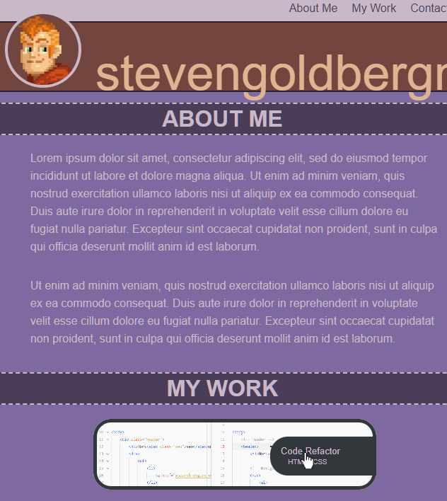

# Portfolio

## Description
This professional portfolio project was a test of my abilities to build a site from scrath using HTML and CSS.
It has the following features:
- Semantic HTML tags for clarity of code
- External CSS sheet with a proper reset to reduce compatibility issues
- Animated links and title cards for my projects
- Complex CSS styling, including flex-boxes
- Dynamic design that changes to match your viewport

## Installation
N/A

## Usage

See the published site: [here](https://stevengoldbergm.github.io/Portfolio/)
- To use the webpage, simply click the links in the navigation bar to be brought to the appropriate section. 
- When you hover over a link, an underline should grow from beneath it.

- Hover over a tab on the right side of a cards in the "My Work" section to reveal project titles and clickable links to the projects.

- Reduce the window size to see how the site shifts to match your viewport!

## License
N/A

